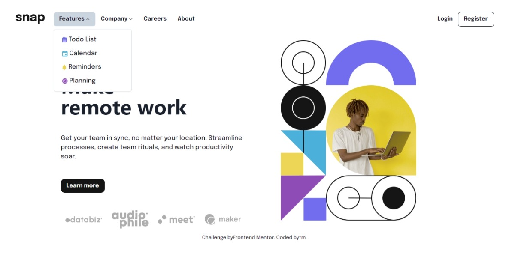
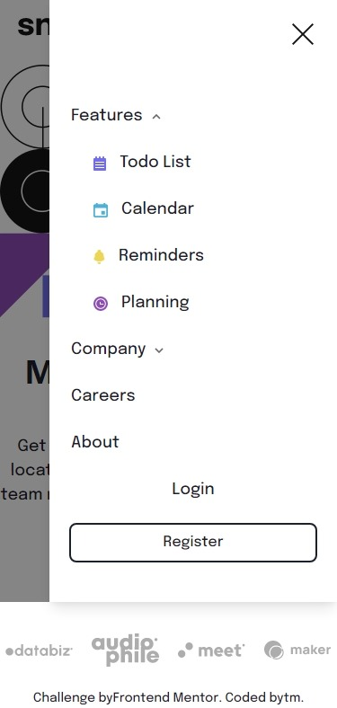

# Frontend Mentor - Intro section with dropdown navigation solution

This is a solution to the [Intro section with dropdown navigation challenge on Frontend Mentor](https://www.frontendmentor.io/challenges/intro-section-with-dropdown-navigation-ryaPetHE5). Frontend Mentor challenges help you improve your coding skills by building realistic projects. 

## Table of contents

- [Overview](#overview)
  - [The challenge](#the-challenge)
  - [Screenshot](#screenshot)
  - [Links](#links)
- [My process](#my-process)
  - [Built with](#built-with)
  - [What I learned](#what-i-learned)
- [Author](#author)

## Overview

### The challenge

Users should be able to:

- View the relevant dropdown menus on desktop and mobile when interacting with the navigation links
- View the optimal layout for the content depending on their device's screen size
- See hover states for all interactive elements on the page

### Screenshot

### Links

- Solution URL: [Solution](https://www.frontendmentor.io/solutions/intro-section-with-dropdown-navigation-using-next-js-rfoUR-tHXj)
- Github URL: [Github](https://github.com/taufiqmahdi/Intro-Section-With-Dropdown-Navigation-Next-JS)
- Live Site URL: [Vercel](https://intro-section-with-dropdown-navigation-next-js.vercel.app/)

## My process

### Built with

- Semantic HTML5 markup
- CSS custom properties
- Flexbox
- [React](https://reactjs.org/) - JS library
- [Next.js](https://nextjs.org/) - React framework
- [Chakra UI](https://chakra-ui.com/) - For styles

### What I learned

Mostly I learned how to use more javascript for the interaction, especially for manipulating component's state

## Author

- Frontend Mentor - [@taufiqmahdi](https://www.frontendmentor.io/profile/taufiqmahdi)
- Twitter - [@taufiqmhdi](https://www.twitter.com/taufiqmhdi)